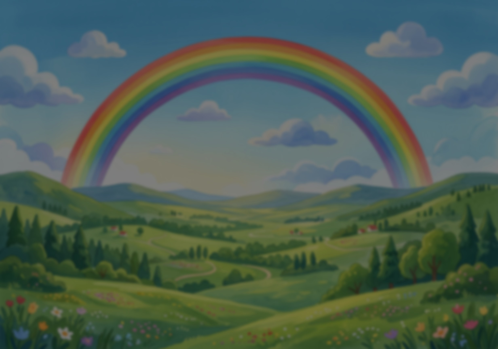
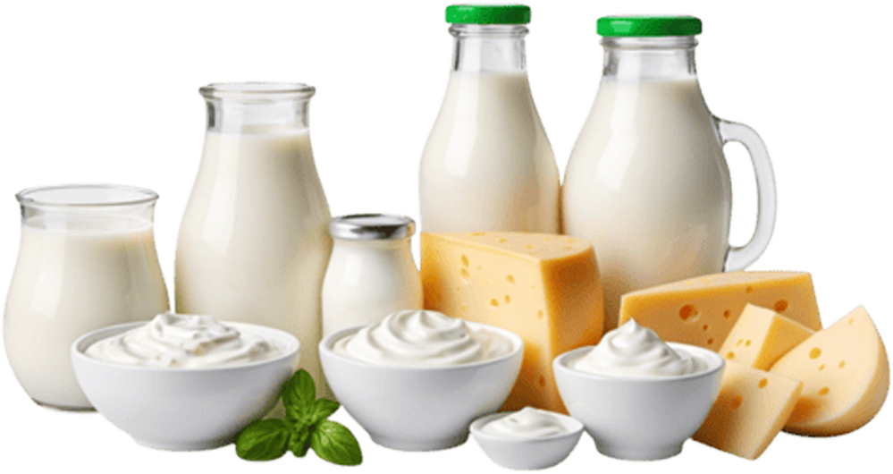
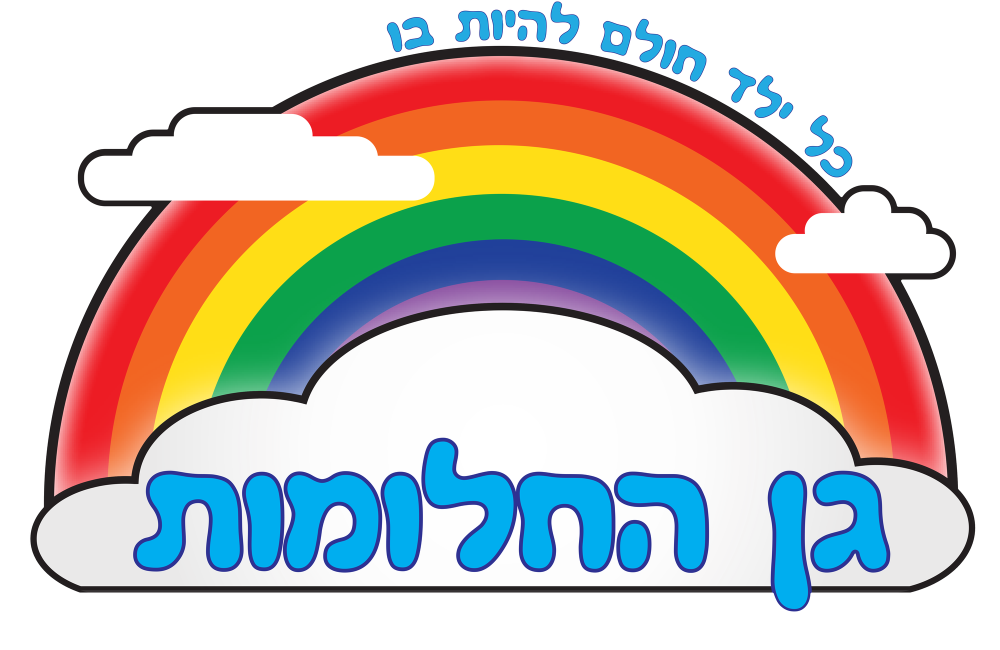
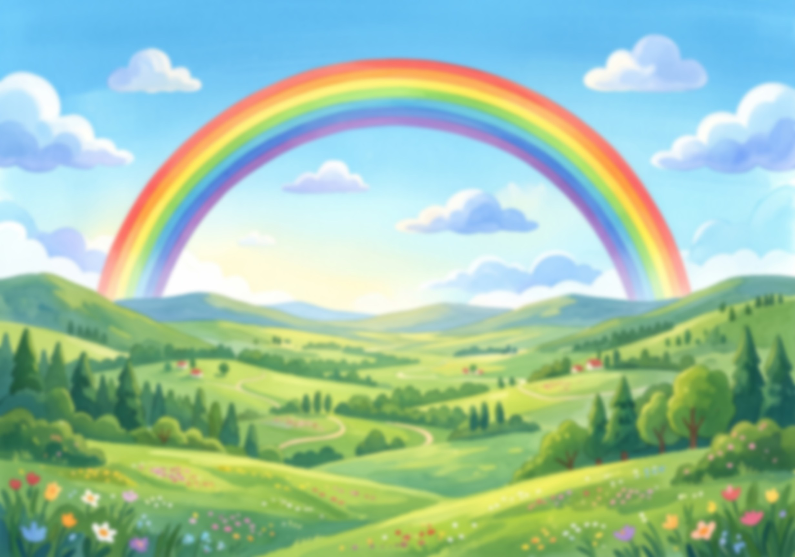
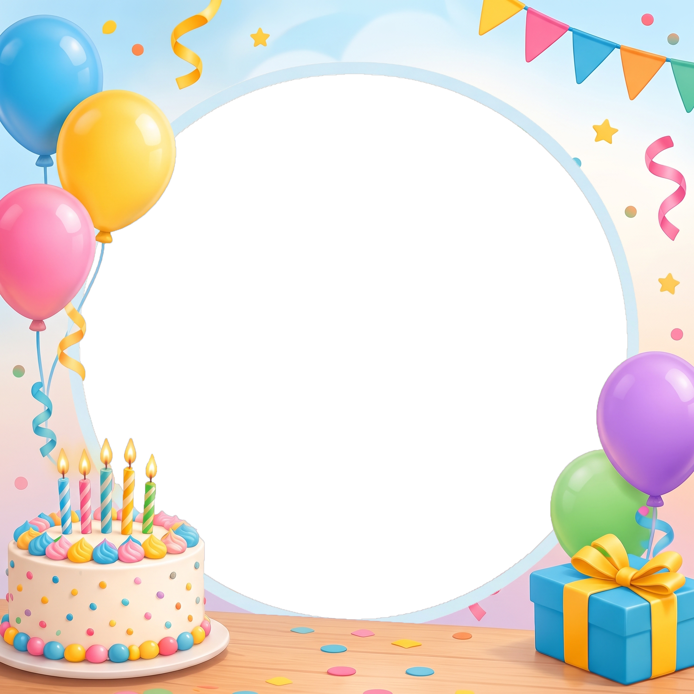
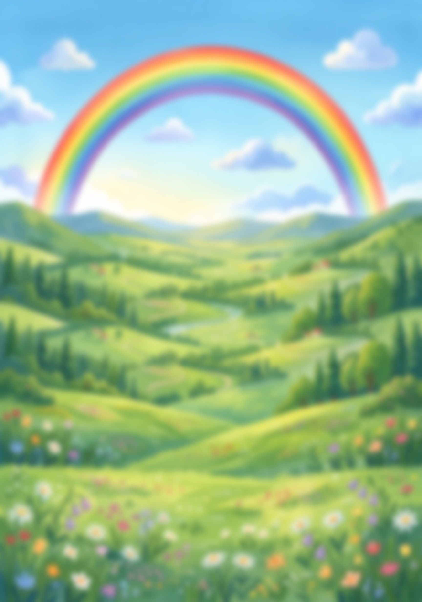

# גן החלומות — ערכת מותג לסטודיו

> קרא את כל הקובץ לפני שמעצבים. כל הקבצים שמוזכרים כאן נמצאים בתיקיית `brand/` שליד המשימה
> (מעמוד ב-`work/` או `out/` מפנים אליהם כ-`../brand/<file>`). כל ה-CSS המשותף נמצא ב-`brand.css` — לקשר אותו תמיד:
> `<link rel="stylesheet" href="../brand/brand.css">`.
> כל המידות כאן נמדדו מקובצי ה-PSD המקוריים (Photoshop) של הגן — לא ניחוש.

## 1. מהות המותג
- **חם, צבעוני, ילדי, אופטימי.** קשת בענן, אחו ירוק עם פרחים, שמיים כחולים עם עננים לבנים.
- הרקע הקבוע של כמעט כל עיצוב הוא **אחו-הקשת** (תמונת איור בסגנון ספר ילדים) — לא צבע אחיד ולא גרדיאנט.
- הכותבים: כתב-יד עגול ושמח (Gveret Levin) בלבן עם **קו מתאר שחור** — זה ה"חתימה" הוויזואלית של הגן.
- שלטים מעשיים (אלרגיות, לוח חופשות) — ברורים וקריאים קודם, חמודים אחר כך.
- הסלוגן (חלק מהלוגו): **"כל ילד חולם להיות בו"**.

## 2. קבצים בערכה

| קובץ | מה זה | מידות |
|---|---|---|
| `logo.png` | הלוגו הרשמי: קשת + עננים + "גן החלומות" + "כל ילד חולם להיות בו", רקע שקוף | 2000×1300 |
| `bg-meadow-landscape.jpg` | אחו-קשת לרוחב, חד (מקור) | 2464×1728 (יחס A4) |
| `bg-meadow-landscape-soft.jpg` | אותו אחו, מטושטש קלות (≈blur 6px) — **זה מה שהשלטים משתמשים בו** | 2464×1728 |
| `bg-meadow-landscape-dim.jpg` | ה-soft + שכבת שחור 51% — רקע שלטי האלרגיה | 2464×1728 |
| `bg-meadow-portrait.jpg` | אחו-קשת לאורך, חד | 1728×2464 |
| `bg-meadow-portrait-soft.jpg` | אותו לאורך, מטושטש (≈blur 16px ב-A4) — רקע לוח ימי ההולדת | 1728×2464 |
| `bday-frame-party.png` | מסגרת יום הולדת: בלונים, עוגה עם נרות, מתנה, דגלונים; **חור עגול שקוף** לתמונה | 2048×2048 |
| `bday-frame-confetti.png` | מסגרת יום הולדת: קונפטי, בלונים, מתנה, **"מזל טוב!" צבעוני כבר אפוי בתמונה**; חור עגול שקוף | 2048×2048 |
| `bday-bg-mazal-tov.jpg` | גרסה בלי חור: "מזל טוב" צבעוני + עיגול לבן ריק עם טבעת תכלת (לטקסט/אימוג׳י במקום תמונה) | 2048×2048 |
| `allergy-milk.png` | גזיר מוצרי חלב (בקבוקים, גבינה, יוגורט), שקוף | 999×530 |
| `allergy-sesame.png` | גזיר ערימת שומשום נופל, שקוף | 784×748 |
| `cert-ribbon.png` | סרט אדום אנכי עם מדליית זהב בתחתית (צד שמאל של תעודה) | 493×3490 |
| `cert-rosette.png` | רוזטת פרס אדום-לבן-כחול עם מרכז לבן ריק | 881×1137 |
| `ref-*.jpg` | **צילומי מסך של העיצובים המקוריים** — להשוואה בעין בלבד, לא לשימוש כרקע | ≤1200px |
| `brand.css` | ‏@font-face + משתני צבע + מחלקות עזר | — |
| גופנים | ראו סעיף 5 | — |

**אין בערכה תמונות של ילדים או אנשים, ואין רשימות שמות.** תמונת ילד מגיעה רק מהמשתמש (`inputs/`).

## 3. לוגו
- הקובץ: `logo.png` (יחס 1.54:1). **לעולם לא למתוח/לעוות** — רק `width` עם `height:auto`.
- לא לצבוע מחדש, לא להוסיף צל, לא לחתוך את הסלוגן, לא לשים על רקע עמוס בלי מרווח.
- מיקומים קבועים:
  - **שלטי A4 לרוחב** (כיתות, אלרגיות): **פינה שמאלית-תחתונה**. רוחב 15.3% מרוחב הדף, 2% משמאל, 1.9% מלמטה (`.logo-corner`).
  - **ריבוע יום הולדת**: **מרכז-תחתון**, רוחב 25% מהרוחב, 0.6% מלמטה (`.logo-bottom-center`). בגרסה בלי כותרת הוא יכול לשבת **מרכז-עליון** (top 0.3%).
  - **A4 לאורך** (לוח ימי הולדת): מרכז-תחתון, רוחב 21.3%, 0.8% מלמטה.
  - **תעודה**: באמצע הדף משמאל, כחלק מהמשפט "סיים בהצטיינות ב-[לוגו]" — רוחב 32.7%.

## 4. צבעים (נדגמו מהקבצים)

| שם (משתנה CSS) | HEX | איפה |
|---|---|---|
| `--gan-blue` | `#00AEEF` | האותיות "גן החלומות" בלוגו + הכחול בקשת |
| `--gan-sky` | `#23AAE1` | הסלוגן בלוגו |
| `--gan-red` | `#ED1C24` | קשת |
| `--gan-orange` | `#F26522` | קשת |
| `--gan-yellow` | `#FFDE16` | קשת |
| `--gan-green` | `#0BA14B` | קשת |
| `--gan-indigo` | `#2E3192` | קשת (פנימי) |
| `--gan-ink` | `#231F20` | קווי מתאר בלוגו |
| `--gan-cloud` | `#EAE9E9` | הצללת העננים |
| `--sign-red` | `#FF0000` | שורת "אלרגיה ל..." בשלט |
| `--bar-black` | `rgba(0,0,0,.77)` | הפס העליון בשלט אלרגיה |
| `--dim-black` | `rgba(0,0,0,.51)` | ההחשכה מעל האחו בשלט אלרגיה |
| `--pill-white` | `rgba(255,255,255,.5)` | "גלולות" השמות בלוח ימי הולדת |
| `--cal-cream` / `--cal-tan` | `#FFF4E3` / `#F8E6CA` | שורות מתחלפות בטבלת חופשות |
| `--cal-peach` | `#FFD699` | שורת הכותרת בטבלת חופשות |
| `--cal-red` | `#CE2027` | טקסט הכותרות בטבלת חופשות |
| `--cert-aqua` → `--cert-center` | `#B9F8F7` → `#EDFCE7` | גרדיאנט רקע התעודה (קצוות → מרכז) |
| `--cert-gold-line` | `#CFC6A4` | קו זהב עדין בתעודה (המסגרת הראשית כהה `#333`) |

אותיות "מזל טוב!" הצבעוניות (מימין לשמאל, אות-אות):
- גרסת **party** (הריבועים המודפסים): מ `#FDD245` · ז `#F7719A` · ל `#48B9E1` · ט `#FCA74C` · ו `#6AC8A9` · ב `#B36BDB` · ! `#FDD245`
- גרסת **confetti** (אפויה במסגרת): מ `#D04CF8` · ז `#40C848` · ל `#F85880` · ט `#48D0F8` · ו `#F8C000` · ב `#F83840` · ! `#C8B058`

## 5. טיפוגרפיה

| משפחה ב-CSS | קובץ | שימוש |
|---|---|---|
| `"Gveret Levin"` | `GveretLevinAlefAlefAlef-Regular.otf` | **הגופן הראשי**: שמות כיתות, כותרות, שמות+תאריכים בלוח ימי הולדת, "מזל טוב!", טקסט התעודה. עברית + ספרות בלבד (**אין אותיות לטיניות**). |
| `"Arial Hebrew Kit"` (400/700) | `ArialHebrew-Regular.ttf`, `ArialHebrew-Bold.ttf` | שלטים מעשיים: אלרגיות, הודעות, טבלאות. |
| `"Gan CLM"` (700) | `GanCLM-Bold.ttf` | כותרת התעודה "אני בוגר/ת!" ושמות ילדים על מוצרי סוף שנה (בקבוקים, תיקים). |
| `"Corsiva Hebrew Kit"` (700) | `CorsivaHebrew-Bold.ttf` | טבלת לוח החופשות (כותרות ותוכן). |
| `"Athelas Kit"` (700) | `Athelas-Bold.ttf` | ספרות התאריכים הלועזיים בטבלת החופשות. |

משתנים מוכנים: `--font-hand`, `--font-sign`, `--font-name`, `--font-cal`, `--font-cal-digits`.

**רישוי:** Gveret Levin — AlefAlefAlef, חינמי גם לשימוש מסחרי. Gan CLM — פרויקט Culmus, ‏GPL-2 (מותר להטמיע). Arial Hebrew, Corsiva Hebrew, Athelas — **גופני מערכת של Apple** (Monotype / TypeTogether): הועתקו לריפו פרטי רק כדי לרנדר מקומית על אותו מק; **לא להפיץ את קובצי הגופן עצמם** (תוצרים מרונדרים — PDF/PNG — זה בסדר). MyriadHebrew הופיע בקובץ ישן אחד בלבד ולא נכלל.

### טיפולי טקסט
- **לבן עם קו מתאר שחור** (שמות כיתות, כותרות, שמות בלוח): Photoshop "Stroke outside". ב-CSS:
  ```css
  .outline-white { color:#fff; -webkit-text-stroke: calc(var(--o) * 2) #000; paint-order: stroke fill; }
  ```
  `--o` = עובי הקו הנראה. יחס קבוע: **≈2% מגובה הגופן** בכותרות גדולות (46mm → 1mm), ≈2.8% בשמות קטנים (12.4mm → 0.35mm).
- **שחור עם קו לבן** (גוף שלט אלרגיה): `.outline-black-on-white`; השורה האדומה: Arial Hebrew **Bold** אדום `#FF0000` + קו לבן.
- השלטים נושאים גם הילה לבנה רכה (Outer Glow 35%) — `.glow`.
- **"מזל טוב!" רב-צבעי**: כל אות ב-`<span data-l="X">X</span>`, אות בצבע משלה, קו שחור עבה, כל אות מסובבת ±3–8° ומוזזת מעט למעלה/למטה (מראה של בלונים). המחלקות `.mazal.mazal--party` עושות את זה (הרווח בין המילים = `<span data-l=" "> </span>`).
- יישור: כותרות במרכז. טקסט מבנה בשלטים — ממורכז בתוך בלוק ימני.
- כיוון: תמיד `dir="rtl"` ו-`lang="he"`.

## 6. תבניות

בכל תבנית: `section.page` בגודל העמוד בדיוק, `position:relative; overflow:hidden`. אחוזים = מתוך רוחב/גובה העמוד.
הסניפים/שמות הגן הם תוכן מהמשתמש — לא להמציא.

### (א) שלט אלרגיה — A4 לרוחב
מקור: `שלטים לכיתות/אלרגיות/*.psd` · השוואה: `ref-allergy-sign.jpg`
- רקע: `bg-meadow-landscape-dim.jpg` (או `-soft` + שכבת `--dim-black`).
- **פס עליון**: כל הרוחב, top 2.6%, גובה 15.2%, `rgba(0,0,0,.77)`. בתוכו: "שימו❤️ כיתה/גן ללא X!" — Arial Hebrew Bold, 29.4mm, לבן + קו שחור 1mm, ממורכז. הלב = אימוג׳י ❤️ אדום.
- **גוש ראשי** (צד ימין, left 33% → right 3.7%, top ≈30%, ממורכז בתוכו): שורה 1 "בכיתה/בגן זה קיימת" Arial Hebrew Regular שחור; שורה 2 "אלרגיה לX" **Bold אדום**; 31.3mm, קו לבן 1mm, line-height ≈1.08.
- **הוראה** (left 36% → right 4.5%, top 69%): "אין להכניס X וכל מה / שעלול להכיל עקבות X" — Arial Hebrew Regular 17.8mm, שחור, קו לבן 0.5mm, 2 שורות.
- **תמונת מוצר** (גזיר שקוף) בצד שמאל: חלב — left 0, top 46.8%, width 40.6%; שומשום — left 1.3%, top 33.7%, width 31.8%. לאלרגן חדש: גזיר שקוף דומה (צילום ריאליסטי של המזון, בלי רקע).
- לוגו: `.logo-corner`.
- וריאציות קיימות: חלב, שומשום, פול; "ילד/ילדה אלרגי/ת ל..." (אותו מבנה).

```html
<section class="page page--a4-landscape" style="font-family:var(--font-sign)">
  
  <div class="top-bar"><div class="outline-white" style="font-weight:700;font-size:29.4mm;line-height:1;--o:1mm">
    שימו<span style="font-size:.82em;-webkit-text-stroke:0">❤️</span> כיתה ללא חלב!</div></div>
  <div class="outline-black-on-white" style="position:absolute;left:33%;right:3.7%;top:30%;text-align:center;font-size:31.3mm;line-height:1.08;--o:1mm">
    <div>בכיתה זו קיימת</div><div style="font-weight:700;color:var(--sign-red)">אלרגיה לחלב</div></div>
  
  <div class="outline-black-on-white" style="position:absolute;left:36%;right:4.5%;top:69%;text-align:center;font-size:17.8mm;line-height:1.12;--o:.5mm">
    אין להכניס חלב וכל מה<br>שעלול להכיל עקבות חלב</div>
  
</section>
```

### (ב) שלט שם כיתה — A4 לרוחב
מקור: `שלטים לכיתות/כיתות הגן/כיתות הגן.psd` · השוואה: `ref-class-sign.jpg`
- רקע: `bg-meadow-landscape-soft.jpg` בלי החשכה.
- טקסט יחיד: "כיתת התינוקיה / הצעירים / הבוגרים" — Gveret Levin **46mm**, לבן, קו שחור 1mm + `.glow`, ממורכז אופקית, מרכז אנכי ב-52.5% (קצת מתחת לאמצע — הקשת "מחבקת" אותו). רוחב הטקסט ≈79% מהדף; שם ארוך → להקטין גופן, לא לשבור שורה.
- לוגו: `.logo-corner`.

```html
<section class="page page--a4-landscape">
  
  <div class="outline-white glow" style="position:absolute;left:0;right:0;top:52.5%;transform:translateY(-55%);
       text-align:center;font-family:var(--font-hand);font-size:46mm;line-height:1;--o:1mm">כיתת הצעירים</div>
  
</section>
```

### (ג) ריבוע יום הולדת לילד — 1:1 (‏2048² במקור; `square` = 1080px)
מקור: `ימי הולדת לילדי הגן/גרסה 1`, `גרסה 2.psd`, ותוצרי "דובי יום הולדת" · השוואה: `ref-birthday-party.jpg`, `ref-birthday-confetti.jpg`
- שכבות מלמטה למעלה: **תמונת הילד (מהמשתמש)** בעיגול → המסגרת (PNG עם חור שקוף) → כותרת → לוגו.
- `bday-frame-party.png` (הגרסה שמודפסת היום): מרכז החור **(51%, 50%)**, קוטר **≈79%**. תמונה: עיגול 80% רוחב, `object-fit:cover`, הפנים במרכז. מעל: "מזל טוב!" רב-צבעי (`.mazal--party`) בראש, top ≈1%, ≈160px ב-1080 (≈15% מהרוחב); לוגו מרכז-תחתון 25%.
- `bday-frame-confetti.png`: הכותרת כבר בפנים; מרכז החור **(50%, 54%)**, קוטר **≈77%**; לוגו מרכז-תחתון 25.8%.
- טבעת התכלת סביב החור היא חלק מהמסגרת — לא לצייר טבעת נוספת.
- אם רוצים שם הילד: Gan CLM או Gveret Levin, לבן עם קו שחור, מתחת לכותרת או על פס בתחתית — לא על הפנים.
- הדפסה: 7×7 ס"מ / 10×10 ס"מ (תיקיות "7*7").

```html
<section class="page page--square">
  <div style="position:absolute;width:80%;aspect-ratio:1;left:51%;top:50%;transform:translate(-50%,-50%);border-radius:50%;overflow:hidden">
    </div>
  
  <div class="mazal mazal--party" style="position:absolute;left:0;right:0;top:1%;text-align:center;font-size:160px;line-height:1.2">
    <span data-l="מ">מ</span><span data-l="ז">ז</span><span data-l="ל">ל</span><span data-l=" "> </span><span data-l="ט">ט</span><span data-l="ו">ו</span><span data-l="ב">ב</span><span data-l="!">!</span></div>
  
</section>
```

### (ד) לוח ימי הולדת — A4 לאורך
מקור: `לוח ימי הולדת/משה דיין/*.psd` (לוח הצוות) · אין ref (מכיל שמות אמיתיים)
- רקע: `bg-meadow-portrait-soft.jpg`.
- כותרת "יש לי יום הולדת!": Gveret Levin 27.2mm, לבן + קו שחור 0.7mm, ממורכז, top 1.2%.
- **שתי עמודות של "גלולות"**: כל גלולה 69.8×15.1mm, `rgba(255,255,255,.5)`, radius 4.2mm; שוליים 19.4mm מימין ומשמאל; שורה ראשונה ב-41mm מלמעלה; רווח אנכי 4.9mm; עד 11 שורות בעמודה (22 אנשים).
- בכל גלולה: **"שם - D.M"** (יום.חודש, בלי שנה, בלי אפס מוביל: `4.7`, `16.11`). Gveret Levin 12.4mm, לבן + קו שחור 0.35mm, ממורכז. שני אנשים עם אותו שם → אות משפחה: "לימור ק."
- סדר: לפי חודש ויום, **עמודה ימנית מלמעלה למטה ואז השמאלית** (`grid-auto-flow:column`).
- לוגו מרכז-תחתון 21.3%.

```html
<section class="page page--a4">
  
  <div class="outline-white" style="position:absolute;left:0;right:0;top:1.2%;text-align:center;font-family:var(--font-hand);font-size:27.2mm;line-height:1.15;--o:.7mm">יש לי יום הולדת!</div>
  <div style="position:absolute;top:41mm;right:19.4mm;left:19.4mm;display:grid;grid-template-columns:69.8mm 69.8mm;justify-content:space-between;
              grid-auto-flow:column;grid-template-rows:repeat(11,15.1mm);row-gap:4.9mm">
    <div class="pill"><span class="outline-white" style="font-family:var(--font-hand);font-size:12.4mm;line-height:1;--o:.35mm;white-space:nowrap">נועה - 1.1</span></div>
    <!-- … one .pill per person … -->
  </div>
  
</section>
```

### (ה) לוח חופשות — טבלה (להדבקה בלוח שנה / A4)
מקור: `לוח חופשות/לוח חופשות ללוח שנה - *.psd/png` · השוואה: `ref-holiday-table.jpg`
- **רקע שקוף/לבן** — הטבלה מודבקת על לוח שנה. בלי אחו ובלי לוגו בגרסת "ללוח שנה".
- עמודות מימין לשמאל: **מועד** 16.7% · **ימים** 22.8% · **תאריך לועזי** 22.3% · **תאריך עברי** 20.3% · **הערות** ~18%. קו מפריד אפור דק `#A29F9F` בין עמודות.
- שורת כותרת: `#FFD699`, פינות מעוגלות (radius ≈1.9% מהרוחב), טקסט Corsiva Hebrew Bold אדום `#CE2027` (עם קו באותו צבע — מעבה).
- שורות: כל שורה = מלבן מעוגל נפרד, צבעים מתחלפים `#FFF4E3` / `#F8E6CA`, רווח ≈1% בין שורות; שורה של שתי שורות טקסט גבוהה ×1.6. טקסט שחור Corsiva Hebrew Bold עם קו שחור דק (מעבה); תאריכים לועזיים ב-Athelas Bold; תאריך עברי עם גרש ׳ (`כט׳ אלול`). "עובדים עד 12:00" בעמודת הערות, גופן קטן יותר.
- הגרסה הישנה ("עדכון 2/3") שייכת ל"מעונות היום של אמונה" — **לא מותג גן החלומות, לא להעתיק**.

```html
<style>
.cal{position:absolute;inset:8mm;display:flex;flex-direction:column;gap:2.1mm;font-family:var(--font-cal);font-weight:700}
.cal .r{display:grid;grid-template-columns:16.7% 22.8% 22.3% 20.3% 1fr;align-items:center;min-height:9.6mm;border-radius:3.7mm;
  background:var(--cal-cream);font-size:6.4mm;line-height:1.05;text-align:center;-webkit-text-stroke:.25mm #000}
.cal .r:nth-child(odd){background:var(--cal-tan)}
.cal .r>div{padding:1mm 1.5mm;border-inline-start:.3mm solid #a29f9f;height:100%;display:flex;align-items:center;justify-content:center}
.cal .r>div:first-child{border:0}
.cal .h{background:var(--cal-peach)!important;color:var(--cal-red);-webkit-text-stroke:.3mm var(--cal-red);font-size:8mm;min-height:10.5mm}
.cal .d{font-family:var(--font-cal-digits)}
</style>
<section class="page page--a4"><div class="cal">
  <div class="r h"><div>מועד</div><div>ימים</div><div>תאריך לועזי</div><div>תאריך עברי</div><div>הערות</div></div>
  <div class="r"><div>ראש השנה</div><div>שישי - ראשון</div><div class="d">11-13.9.26</div><div>כט׳ אלול-ב׳ תשרי</div><div></div></div>
</div></section>
```

### (ו) תעודת סיום לבוגרים — A4 לאורך
מקור: `סיום שנה - תשפ״ו/תעודת סיום שנה לבוגרים/*.psd` · השוואה: `ref-certificate.jpg`
- רקע: לבן + `radial-gradient(ellipse at 50% 45%, #EDFCE7 0%, #B9F8F7 100%)` באטימות ≈90%.
- מסגרת: קו כהה דק (`#333`, ≈0.4mm) מוזח 4.3% מהצדדים ו-≈2% מלמעלה/למטה, **קטוע מאחורי הכותרת**; בנוסף קו זהב-בהיר `#CFC6A4` כמעט שקוף.
- `cert-ribbon.png` בצד שמאל לכל הגובה (left 2%, height 99.5%).
- כותרת **"אני בוגר!" / "אני בוגרת!"**: Gan CLM Bold ≈28mm שחור, top 6.9%, ממורכזת באזור שמימין לסרט (מרכז ≈53%).
- "וזאת לתעודה כי:" Gveret Levin ≈10mm שחור (top 21%) → **תיבת שם**: מלבן מעוגל עם קו כהה דק, left 23% → right 10.4%, top 27%–36.8%, מילוי לבן שקוף-למחצה.
- שורה: "סיים/סיימה בהצטיינות ב-" (ימין, top 46.6%) + **הלוגו** משמאל (left 21.9%, top 41%, width 32.7%).
- "את שנת הלימודים תשפ״ו" (top 60.7%) · "והוא זכאי / והיא זכאית לעלות לגן עירייה" (top 68%) · "על החתום," (ימין, top 82%) · שני קווי חתימה דקים (left 23% → right 6%, ב-86.3% וב-93.6%).
- כל גוף הטקסט Gveret Levin ≈10mm שחור, בלי קו מתאר, ממורכז סביב ≈55% מהרוחב (האזור שמימין לסרט). אופציונלי: `cert-rosette.png` כקישוט.

### (ז) דף תמונות למגירות — A4 לאורך
מקור: `שלטים לכיתות/הדפסת תמונות למגירות לילדים.psd` — **רק תמונות של ילדים, בלי טקסט ובלי לוגו**.
- רקע לבן; 2 עמודות × 3 שורות; כל תמונה ≈74×92mm (פורטרט 4:5), `object-fit:cover`; שוליים ≈21mm מהצדדים, ≈9mm מלמעלה; רווח ≈18mm בין עמודות ו-≈4mm בין שורות. התמונות מהמשתמש בלבד.

### (ח) מוצרי סוף שנה (בקבוקים, תיקים, קופסאות אוכל, פונצ׳ו)
מקור: `סיום שנה - תשפ״ו/` — עבודות הדפסת סובלימציה עם שם הילד ב-**Gan CLM Bold** ותמונה. הפקה שם נעשית בסקריפטים ייעודיים (CMYK + פרופיל ICC של ה-PSD) — לא בסטודיו. אם מבקשים "שם על מוצר": Gan CLM Bold, שחור או בצבע מהקשת, ממורכז.

## 7. עיצוב חדש שלא מופיע כאן
- התחל מאחו-הקשת המתאים לכיוון (`landscape`/`portrait`, `-soft` כשיש טקסט מעליו), כותרת Gveret Levin לבנה עם קו שחור, לוגו בפינה שמאלית-תחתונה (לרוחב) או מרכז-תחתון (לאורך/ריבוע).
- תוכן "שימושי" (שעות, רשימות, טבלאות) — Arial Hebrew על משטחים חצי-שקופים (`.pill`, `.top-bar`) כדי שיהיה קריא מעל האיור.
- צבעי הדגשה — רק מתוך צבעי הקשת של הלוגו.
- אחרי רינדור: להשוות בעין מול ה-`ref-*.jpg` הקרוב.

## 8. מה לא לעשות
- ❌ לא למתוח, לחתוך, לצבוע מחדש או להחליף את הלוגו; לא לצייר "לוגו" חדש בטקסט.
- ❌ לא להשתמש בתיקיית `brand/` של הריפו (שם המותג "חלום" — מוצר SaaS אחר!) ולא בצבעים שלו.
- ❌ לא רקעים בצבע אחיד/גרדיאנט טכנולוגי, לא אייקונים "קורפורייטיים", לא אותיות דקות אפורות.
- ❌ לא טקסט לבן בלי קו מתאר על האחו (נבלע); לא טקסט שחור בלי קו לבן על האחו המוחשך.
- ❌ לא לשים טקסט/לוגו על פני הילד בתמונה; לא לכסות את טבעת התכלת של המסגרת.
- ❌ לא להמציא תמונות של ילדים, לא להשתמש בתמונות ילדים מעבודות קודמות, לא לכתוב שמות ילדים שלא נמסרו במשימה.
- ❌ לא לטשטש יותר מדי: הטשטוש ברקע עדין (הקשת והעצים עדיין מזוהים).
- ❌ Gveret Levin לא תומך באותיות לטיניות — טקסט באנגלית: Arial Hebrew Kit.
- ❌ לא להעתיק את עיצוב "מעונות היום של אמונה" (לוח חופשות עדכון 2/3) — זה מותג אחר.
- ❌ לא להפיץ את קובצי הגופנים של Apple (Arial Hebrew, Corsiva Hebrew, Athelas) — רק תוצרים מרונדרים.
